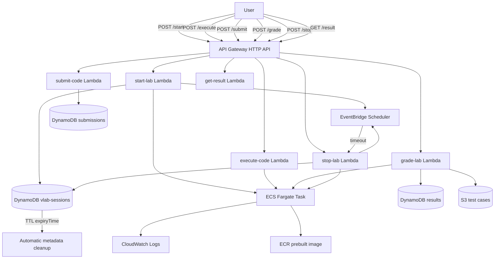

# Ephemeral Multi-Lab on AWS (Terraform + CI/CD)

Production-ready infrastructure for isolated, short-lived multi-lab sessions using ECS Fargate.  
Each lab session is mapped to one task, auto-stopped via EventBridge Scheduler, and tracked in DynamoDB with TTL backup cleanup.

## Architecture



## Resource Coverage

- ECR repositories per lab type (`python`, `java`, `linux`, `dbms`)
- VPC with private subnets, optional NAT Gateway
- Security groups and VPC endpoints for ECR/CloudWatch/S3 access
- ECS cluster + Fargate task definition with ephemeral storage
- Start/stop Lambda functions
- API Gateway routes:
  - `POST /start`
  - `POST /execute`
  - `POST /submit`
  - `POST /grade`
  - `POST /stop`
  - `GET /result`
- EventBridge Scheduler schedule group (one-time stop schedules)
- DynamoDB tables:
  - `vlab-sessions` (TTL: `expiryTime`)
  - `lab-submissions`
  - `lab-results`
- S3 bucket for grading test cases
- IAM roles/policies with scoped permissions
- CloudWatch logs for ECS, Lambda, API Gateway
- Optional ALB
- Optional S3 temp data bucket

## Project Layout

```text
terraform/
  main.tf
  variables.tf
  outputs.tf
  vpc.tf
  ecs.tf
  lambda.tf
  api_gateway.tf
  iam.tf
  dynamodb.tf
  eventbridge.tf
  ecr.tf
  security_groups.tf
lambda/
  start_lab.py
  stop_lab.py
  execute_code.py
  submit_code.py
  grade_lab.py
  cleanup_expired.py
  get_result.py
.github/workflows/
  deploy.yml
lab-images/
  python/Dockerfile
  java/Dockerfile
  linux/Dockerfile
  dbms/Dockerfile
lab_server.py
```

## Runtime Flow

1. Client calls `POST /start` with `userId`, `labType`, and optional `duration`.
2. `start-lab` Lambda validates `labType`, selects image dynamically, and launches one Fargate task (`assignPublicIp=DISABLED`).
3. Lambda creates one-time EventBridge schedule to invoke `stop-lab`.
4. Lambda stores session record in DynamoDB (`sessionId`, `userId`, `labType`, `taskArn`, `startTime`, `expiryTime`, `status`).
5. User uses lab runtime.
6. Student calls `POST /execute` for syntax validation + execution.
7. Student calls `POST /submit` to persist submission and trigger grading.
8. Timeout or manual stop calls `stop-lab`.
7. `stop-lab` stops ECS task, deletes schedule, deletes DynamoDB record.
8. DynamoDB TTL acts as backup metadata cleanup.

## Prerequisites

- Terraform `>= 1.6`
- AWS account + IAM role for GitHub OIDC
- GitHub repository secrets:
  - `AWS_GITHUB_ACTIONS_ROLE_ARN`

## Local Deploy (Terraform CLI)

```bash
cd terraform
terraform init
terraform plan -out tfplan
terraform apply tfplan
```

Optional destroy:

```bash
terraform destroy
```

## CI/CD (GitHub Actions)

Workflow: `.github/workflows/deploy.yml`

- Build four Docker images and push to ECR:
  - `vlab:latest`
  - `java-lab:latest`
  - `linux-lab:latest`
  - `dbms-lab:latest`
- `terraform init`, `fmt`, `validate`, `plan`
- Optional `apply` via `workflow_dispatch` input (`apply=true`)
- Optional `destroy` job via `workflow_dispatch` input (`destroy=true`)

For manual approval on apply, configure GitHub **Environment** `production` with required reviewers.

## API Contracts

### `POST /start`

Request body:

```json
{
  "userId": "user-123",
  "labType": "python",
  "duration": 45,
  "environment": {
    "LAB_TOPIC": "loops"
  }
}
```

Response:

```json
{
  "sessionId": "uuid",
  "labType": "python",
  "status": "RUNNING",
  "expiresAt": "2026-04-22T12:00:00+00:00",
  "connectionInfo": {
    "taskArn": "arn:aws:ecs:...",
    "clusterArn": "arn:aws:ecs:...",
    "region": "us-east-1"
  }
}
```

### `POST /execute`

Request body:

```json
{
  "sessionId": "uuid",
  "labType": "python",
  "code": "print('hello')"
}
```

Response format:

```json
{
  "success": true,
  "syntaxError": "",
  "runtimeError": "",
  "output": "hello"
}
```

### `POST /stop`

Request body:

```json
{ "sessionId": "uuid" }
```

Response:

```json
{
  "sessionId": "uuid",
  "status": "STOPPED"
}
```

Idempotency: repeated stop requests safely return success when session is already removed.

## Security Notes

- Least-privilege IAM policies for Lambda, Scheduler, ECS
- Lab tasks run in private subnets without public IP
- API Gateway currently uses `authorization_type = NONE` as a placeholder
- Add JWT/Lambda authorizer before public exposure
- Consider WAF, KMS CMKs, and tighter egress controls for stricter environments

## Key Terraform Variables

- `region`
- `project_name`
- `environment`
- `lab_types`
- `lab_cpu`
- `lab_memory`
- `lab_cpu_by_type`
- `lab_memory_by_type`
- `session_timeout_minutes`
- `enable_nat_gateway`
- `enable_alb`
- `enable_temp_data_bucket`
- `dynamodb_table_name`

Example per-lab sizing:

```hcl
lab_cpu    = 512
lab_memory = 1024

lab_cpu_by_type = {
  python = 512
  java   = 1024
  linux  = 512
  dbms   = 1024
}

lab_memory_by_type = {
  python = 1024
  java   = 2048
  linux  = 1024
  dbms   = 3072
}
```

## Outputs

- API Gateway URL
- ECR repository URLs
- ECS cluster name
- Lambda ARNs
- DynamoDB tables
- S3 test case bucket
- Optional ALB DNS name
