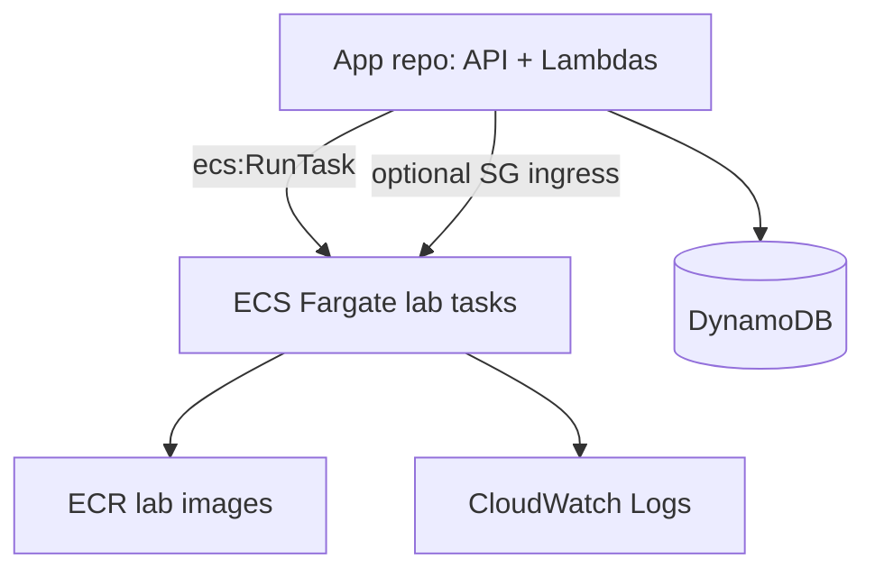

# Ephemeral Multi-Lab on AWS (Terraform + CI/CD)

Production-ready **lab infrastructure**: ECS Fargate task definitions, ECR images, VPC, DynamoDB, and S3 test cases.  
API Gateway, Lambda, and the student-facing API live in a **separate application repository** — wire that repo to the Terraform outputs from this project.

## Architecture



## Resource Coverage (this repo)

- ECR repositories per lab type (+ shared base images)
- VPC with private subnets, optional NAT Gateway, VPC endpoints (ECR, ECS, S3, CloudWatch, SSM)
- ECS cluster + Fargate task definitions per lab type (with per-type CPU/memory overrides)
- DynamoDB tables: sessions, runs, submissions, results
- S3 bucket for grading test cases
- IAM roles for ECS task execution and ECS Exec
- CloudWatch log group for ECS tasks
- Optional S3 temp data bucket

## Project Layout

```text
terraform/
  main.tf
  variables.tf
  outputs.tf
  vpc.tf
  ecs.tf
  iam.tf
  dynamodb.tf
  ecr.tf
  security_groups.tf
  backend_resources.tf
.github/workflows/
  deploy.yml
lab-images/
  <lab-type>/Dockerfile
  common/lab_server.py
```

> Runtime images are defined per lab type under `lab-images/<type>/Dockerfile`.

## Wiring the app repo

After `terraform apply`, use outputs in your API/Lambda repo:

- `ecs_cluster_arn` / `ecs_cluster_name`
- `ecs_task_definition_arns` (map by lab type)
- `private_subnet_ids`
- `ecs_task_security_group_id` — allow your Lambda SG via `lab_control_plane_security_group_ids` in this repo, or add an ingress rule in the app repo
- `ecs_task_execution_role_arn` and `ecs_task_role_arn` (for `iam:PassRole` on `RunTask`)
- `dynamodb_tables`, `ecr_repository_urls`, `test_cases_bucket`

## Prerequisites

- Terraform `>= 1.6`
- AWS account + IAM role for GitHub OIDC
- GitHub repository secrets:
  - `AWS_GITHUB_ACTIONS_ROLE_ARN`

## Local Deploy (Terraform CLI)

```bash
cd terraform
terraform init
terraform plan -out tfplan
terraform apply tfplan
```

Optional destroy:

```bash
terraform destroy
```

## CI/CD (GitHub Actions)

Workflow: `.github/workflows/deploy.yml`

Triggers on push to `main` (changes to `terraform/`, `lab-images/`) or `workflow_dispatch`.

Jobs:
1. `build-and-push` — builds and pushes all four lab images to ECR (`python`, `java`, `linux`, `dbms`)
2. `terraform-plan` — runs `init`, `fmt -check`, `validate`, `plan`
3. `terraform-apply` — runs on `workflow_dispatch` with `apply=true`
4. `terraform-destroy` — runs on `workflow_dispatch` with `destroy=true`

For manual approval on apply, configure GitHub **Environment** `dev` with required reviewers.

## API contracts

HTTP API routes and Lambda handlers are maintained in the **application repository**, not this repo.

## Key Terraform Variables

| Variable | Default | Description |
|---|---|---|
| `region` | `ap-south-1` | AWS region |
| `project_name` | `vlab` | Resource name prefix |
| `environment` | `dev` | Deployment environment |
| `lab_types` | see `variables.tf` | Supported lab types |
| `lab_cpu` | `512` | Default ECS task CPU units |
| `lab_memory` | `1024` | Default ECS task memory (MiB) |
| `lab_cpu_by_type` | `dbms = 1024` | Per-type CPU overrides |
| `lab_memory_by_type` | `dbms = 6144` | Per-type memory overrides |
| `lab_control_plane_security_group_ids` | `[]` | Lambda/API SGs allowed to reach tasks on 8080/8888 |
| `ephemeral_storage_gib` | `30` | Fargate ephemeral storage (GiB) |
| `enable_nat_gateway` | `false` | Enable NAT Gateway |
| `enable_temp_data_bucket` | `false` | Enable temp S3 bucket |
| `dynamodb_table_name` | `vlab-sessions` | Sessions table name |

Example per-lab sizing:

```hcl
lab_cpu_by_type = {
  dbms = 1024
}

lab_memory_by_type = {
  dbms = 6144
  java = 2048
}
```

## Outputs

- `ecs_cluster_name` / `ecs_cluster_arn`
- `ecs_task_definition_arns` — task definition ARNs by lab type
- `ecs_task_security_group_id`, `private_subnet_ids`
- `ecs_task_execution_role_arn`, `ecs_task_role_arn`
- `ecr_repository_urls`, `ecr_lab_base_repository_urls`
- `dynamodb_tables`, `test_cases_bucket`

## Security Notes

- Least-privilege IAM for ECS task roles
- Lab tasks run in private subnets without public IP
- Set `lab_control_plane_security_group_ids` so your app-repo Lambdas can reach lab tasks on 8080/8888
- Consider WAF, KMS CMKs, and tighter egress controls for stricter environments
