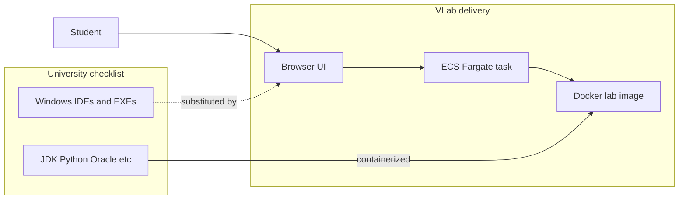

# Virtual Lab Equivalence Document

**Project:** IgnitoLearn Virtual Lab (VLab)  
**Platform:** Browser-accessible labs on AWS ECS Fargate (containerized Docker images)  
**Audience:** University faculty and IT for syllabus / software-requirements alignment  
**Last updated:** June 2026

---

## 1. Delivery model

Students do **not** install Windows `.exe` installers on personal machines. Instead:

1. They sign in to the VLab web portal from any OS (Windows, macOS, Linux, Chromebook).
2. The platform starts a **dedicated ECS Fargate task** with a subject-specific Docker image.
3. Students work in a **browser-based IDE** (Monaco editor, Jupyter, or code-server), a **web terminal**, or linked web tools (e.g. Draw.io).
4. Runtimes and CLIs (JDK, Python, Oracle, Hadoop, gcc, Android SDK, Selenium) run **inside the container**; results are shown in the browser.

This is the industry-standard pattern for cloud virtual labs: **containerized runtimes + browser UI**, not replicated desktop installers.

**Benefits for the university**

- No lab-room Windows imaging or license management per seat.
- Consistent environment for every student every session.
- Works on student-owned devices; only a modern browser is required.

---

## 2. Equivalence table (university requirement → VLab substitute)

### Tier 1 — Strong equivalence (runtimes / CLIs)

Universities typically accept **newer compatible versions** in a maintained cloud lab.

| Subject | University requires | VLab delivers | Image / notes |
|---------|---------------------|---------------|---------------|
| **DBMS** | Oracle 10g XE or **21c XE** | Oracle XE **21** (`gvenzl/oracle-xe:21`) + MySQL + PostgreSQL | `lab-images/dbms/Dockerfile` |
| **Linux** | gcc, gdb, make | gcc, **gdb**, make via `build-essential` | `lab-images/linux/Dockerfile` |
| **Software Testing** | Selenium WebDriver, JDK, Python | Chrome + ChromeDriver + `selenium` (pip) + OpenJDK 17 | `lab-images/testing/Dockerfile` |
| **Big Data** | Hadoop 2.7.3, JDK 8 | Hadoop **3.3.6**, JDK **21**, Maven | `lab-images/bigdata/Dockerfile` — confirm syllabus if legacy 2.x APIs are required |
| **Java** | JDK 24 | JDK **21** (Eclipse Temurin) | `lab-images/base/java/Dockerfile` — JDK 24 can be pinned if faculty insists |
| **Python** | Python 3.7.0 | Python **3.11** | `lab-images/base/python/Dockerfile` |

### Tier 2 — Functional substitute (same learning outcome, different product)

| Subject | University requires | VLab substitute | Message for faculty |
|---------|---------------------|-----------------|---------------------|
| **Java** | Eclipse 4.36 + Notepad++ | Browser Monaco IDE + `javac`/`java` via `lab_server` | Students write, compile, and run Java without a local IDE install |
| **Python** | PyCharm + Sublime Text | Browser Monaco IDE + Python 3.11 | Same workflow in the browser |
| **.NET** | Visual Studio 2022 Community | **code-server** (VS Code in browser) + .NET SDK 8 | C# / ASP.NET labs via CLI and browser editor |
| **Software Eng / Agile** | Draw.io (desktop or web) | **Draw.io web** — `drawio.html` in workspace links to [app.diagrams.net](https://app.diagrams.net/) | Same official tool; no install |
| **Software Testing** | Selenium IDE (browser extension) | Programmatic Selenium (Python) in container | Record-and-playback UI differs; **automation concepts are the same** |
| **Software Engineering** | UML / design tools | code-server + PlantUML + Draw.io landing page | Diagrams via Draw.io web + PlantUML CLI |

### Tier 3 — Gaps requiring explicit university agreement

| Subject | Gap | Why Docker alone is not enough | Recommended VLab position |
|---------|-----|--------------------------------|---------------------------|
| **Mobile** | Android Studio GUI + emulator | Heavy desktop IDE; emulator needs KVM/GPU — poor fit on Fargate | **CLI Android SDK + Gradle** in container; see §5 |
| **Data Science-I** | RStudio + Anaconda | Current image is **Jupyter + Python (pip)** only | **Phased approach** — see §5 |
| **Big Data** | Eclipse IDE for MapReduce | No Eclipse GUI in image | Monaco / code-server + Maven if faculty agrees |
| **Software Testing** | Selenium IDE extension | Extension not available inside lab browser the same way | WebDriver-based scripts are the cloud-lab equivalent |

---

## 3. Version policy

Unless a lab manual explicitly depends on legacy behavior:

| Component | University spec (typical) | VLab default | Policy |
|-----------|----------------------------|--------------|--------|
| JDK | 8 / 24 | **21** (Temurin LTS) | Newer LTS unless syllabus requires older bytecode/API |
| Python | 3.7 | **3.11** | Newer stable; rare 3.7-only syntax should be flagged |
| Oracle | 10g XE or 21c XE | **21c XE** | Matches the 21c option on the university list |
| Hadoop | 2.7.3 | **3.3.6** | Acceptable for API-based labs; legacy 2.7 sidecar only if required |
| Android SDK | Android Studio bundle | **Command-line SDK 33** + Gradle | Build APK/AAB via CLI; no full Studio GUI |
| Selenium | IDE + WebDriver | **WebDriver** (Chrome + chromedriver) | IDE workflow replaced by code |

We maintain images on a rolling basis with security patches. Faculty should share **lab manuals or PDFs** for version-specific exercise validation before go-live.

---

## 4. Course-by-course mapping (11 VLab labs)

| University subject | VLab lab ID | Docker image | Feasible? | Exact university tools required? |
|-------------------|-------------|--------------|-----------|----------------------------------|
| Java Programming | `java-lab` | `lab-images/java` | Yes | **No** — JDK yes; Eclipse/Notepad++ → browser IDE |
| Python Programming | `python-lab` | `lab-images/python` | Yes | **No** — Python yes; PyCharm/Sublime → browser IDE |
| DBMS | `dbms-lab` | `lab-images/dbms` | Yes | Oracle 21c XE matches one listed option |
| Linux + Networking | `linux-lab` | `lab-images/linux` | Yes | gcc, **gdb**, make in container |
| Mobile Application | `mobile-app-lab` | `lab-images/android` | **Partial** | Android Studio GUI/emulator is the hard part — CLI SDK provided |
| Web Technology .NET | `dotnet-lab` | `lab-images/dotnet` | Yes | VS 2022 → code-server + .NET SDK 8 |
| Software Engineering | `software-eng-lab` | `lab-images/softwareengeering` | Yes | Draw.io web + code-server + PlantUML |
| Data Science-I | `data-science-lab` | `lab-images/datascience` | **Partial** | Jupyter + Python today; R/conda only if syllabus mandates R |
| Big Data Analytics-I | `big-data-lab` | `lab-images/bigdata` | Yes (caveats) | Hadoop/JDK versions differ; no Eclipse unless added |
| Software Testing Automation | `testing-lab` | `lab-images/testing` | Mostly | WebDriver yes; Selenium IDE workflow differs |
| Agile Methodology | `agile-lab` | `lab-images/agilemethodology` | Yes | Draw.io web + browser IDE |

---

## 5. Tier 3 decisions (recommended for university proposal)

### 5.1 R, RStudio, and Anaconda (Data Science-I)

**Current delivery:** Jupyter Notebook on port 8888 with Python 3.11, pandas/scikit-learn/seaborn stack (`lab-images/datascience`).

**University list:** RStudio + Anaconda.

**Recommended phased approach**

| Phase | Scope | When |
|-------|-------|------|
| **Phase 1 (now)** | Python-centric data science via Jupyter | Syllabus exercises are Python/pandas/matplotlib |
| **Phase 2 (if mandated)** | Add R runtime + RStudio Server or conda envs in a dedicated image layer | Faculty confirms R exercises are **mandatory**, not illustrative |

**Rationale:** Most introductory data-science syllabi can be delivered in Python; adding RStudio Server increases image size and operational complexity. Confirm with faculty before investing in Phase 2.

### 5.2 Android Studio GUI and emulator (Mobile Application)

**Current delivery:** Android command-line SDK (platform 33, build-tools, platform-tools), Gradle, OpenJDK 17 (`lab-images/android`). Students build and manage projects via CLI and browser IDE terminal.

**University list:** Android Studio (full IDE) + emulator.

**Recommended position**

- **Accept for cloud lab:** Android SDK, `sdkmanager`, `gradle`, APK builds, manifest/resources editing in browser IDE.
- **Do not promise on Fargate:** Android Studio GUI, AVD emulator with GPU/KVM (not supported on standard Fargate tasks).
- **Alternatives if emulator is mandatory:** Physical device + USB debugging instructions, or a separate GPU/KVM VM service outside Fargate (higher cost; requires separate approval).

### 5.3 Selenium IDE browser extension (Software Testing)

**Current delivery:** Headless-capable Chrome, matching ChromeDriver, Python `selenium` package, JDK 17 for Java-based tests.

**University list:** Selenium IDE extension.

**Recommended position:** Teach **WebDriver automation** (locators, waits, assertions) in Python or Java. The IDE’s record-and-playback UI is illustrative; programmatic tests are what production QA uses and what fits a container lab.

---

## 6. Questions for the university (Tier 3 clarification)

Please confirm whether the following are **mandatory for assessment** or **illustrative examples** on the software checklist:

1. **Android Studio GUI and emulator**  
   - Are students graded on IDE-specific workflows (Layout Editor, AVD emulator), or on building/debugging Android apps in general?  
   - Would **CLI SDK + Gradle + browser editor** satisfy practical exams?

2. **RStudio and Anaconda (Data Science-I)**  
   - Does the syllabus include **R-specific** assignments (e.g. `ggplot2`, dplyr in R)?  
   - Or is the course primarily **Python** with Anaconda/RStudio listed as a generic data-science stack?

3. **Selenium IDE browser extension**  
   - Are students required to submit **IDE-recorded** test suites (`.side` files)?  
   - Or is **Selenium WebDriver** scripting (Python/Java) sufficient?

4. **Version pinning**  
   - Are any subjects tied to **exact versions** (Hadoop 2.7.3, JDK 8, Python 3.7) in published lab manuals?  
   - If yes, please share manuals for targeted compatibility testing.

5. **Cloud virtual lab acceptance**  
   - Does the university accept a **functionally equivalent cloud lab** (this document) in place of installing the Windows `.exe` list in a physical lab?

---

## 7. Pilot recommendation

Offer a **pilot** of 1–2 subjects (e.g. **Java Programming** + **DBMS**) for faculty to run through existing lab exercises before full rollout. Use pilot feedback to prioritize Tier 3 work (R image, Android emulator alternative).

---

## 8. What we do not do

- Install Windows `.exe` IDEs (Eclipse, PyCharm, Android Studio, Visual Studio 2022) inside Linux containers — fragile, huge, incompatible with Fargate.
- Claim exact version parity without validating against supplied lab manuals.
- Promise Android emulator or full desktop IDEs on Fargate without explicit sign-off and infrastructure changes.

---

## 9. Key message for stakeholders

The university software list describes **skills students need**, not necessarily **how those skills must be packaged**. For cloud virtual labs, containerized runtimes plus browser-based editors are the standard, auditable approach. This document maps each listed tool to its VLab equivalent so faculty can approve **outcomes**, not installer names.
